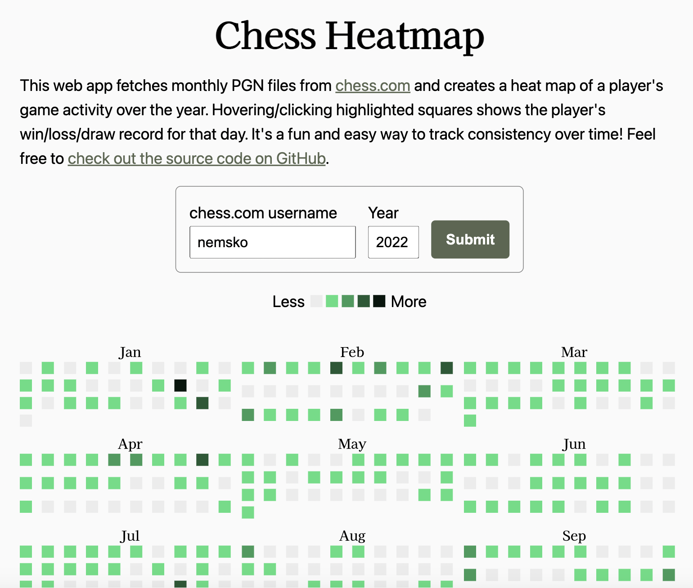

# chess-heatmap

This web app fetches monthly PGN files from <a href="https://chess.com">chess.com</a> and creates a heatmap of a player's game activity over the year. Hovering/clicking highlighted squares shows the player's win/loss/draw record for that day. It's a fun and easy way to track consistency over time!



---

## How it works

The form takes a username and year. Upon submission, we make up to 12 api calls to the chess.com backend for monthly PGNs for the username for the given year.

We wait to receive the response to our previous request before making the next request. This way, we should never encounter rate limiting according to the chess.com API documentation.

If we make requests in parallel (for example, in a threaded application or a webserver handling multiple simultaneous requests), then some requests may be blocked depending on how much work it takes to fulfill the previous request. This would result in a "429 Too Many Requests" response from chess.com's server for any non-serial request.

## Parsed PGN to object

PGN:

```
[Event "Live Chess"]
[Site "Chess.com"]
[Date "2023.03.25"]
[Round "-"]
[White "Djembe58"]
[Black "max_mayo"]
[Result "0-1"]
[CurrentPosition "8/pr4pp/5pk1/p1K5/5P2/6PP/8/8 w - -"]
[Timezone "UTC"]
[ECO "B10"]
[ECOUrl "https://www.chess.com/openings/Caro-Kann-Defense-2.f4-d5"]
[UTCDate "2023.03.25"]
[UTCTime "16:14:06"]
[WhiteElo "1213"]
[BlackElo "1242"]
[TimeControl "900+10"]
[Termination "max_mayo won by resignation"]
[StartTime "16:14:06"]
[EndDate "2023.03.25"]
[EndTime "16:36:51"]
[Link "https://www.chess.com/game/live/73500008985"]
```

Annotations parsed from the PGN:

```json
{
  "Event": "Live Chess",
  "Site": "Chess.com",
  "Date": "2023.03.25",
  "Round": "-",
  "White": "Djembe58",
  "Black": "max_mayo",
  "Result": "0-1",
  "CurrentPosition": "8/pr4pp/5pk1/p1K5/5P2/6PP/8/8 w - -",
  "Timezone": "UTC",
  "ECO": "B10",
  "ECOUrl": "https://www.chess.com/openings/Caro-Kann-Defense-2.f4-d5",
  "UTCDate": "2023.03.25",
  "UTCTime": "16:14:06",
  "WhiteElo": "1213",
  "BlackElo": "1242",
  "TimeControl": "900+10",
  "Termination": "max_mayo won by resignation",
  "StartTime": "16:14:06",
  "EndDate": "2023.03.25",
  "EndTime": "16:36:51",
  "Link": "https://www.chess.com/game/live/73500008985"
}
```
